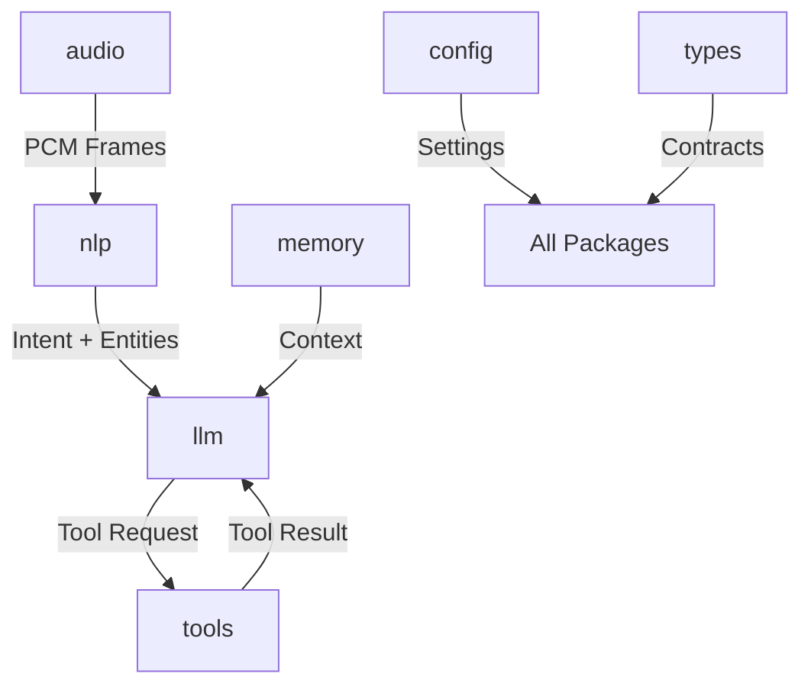

# 📦 Shared Packages — Domain & Logic Layer

This directory contains the core domain logic, types, and utilities shared across all services in the AI Voice Platform.

## Architecture Overview

The packages are designed to be **modular, stateless, and highly typed**. They follow a strict separation of concerns to ensure the system remains scalable and auditable.



---

## 🛠️ Package Breakdown

### 1. [`audio`](./audio)

**Role**: Low-level audio processing and utilities.

- **Responsibilities**: Frame buffering, silence detection, resampling, and latency tracking.
- **Key Exports**: `AudioFrame`, `SilenceDetector`, `Resampler`.
- **Connection**: Ingested by the `ai-agent` and passed to `nlp` after noise suppression.

### 2. [`nlp`](./nlp)

**Role**: Language intelligence and understanding.

- **Responsibilities**: Language detection (English/Hindi), Hinglish classification, intent parsing, and entity extraction.
- **Key Exports**: `NLPPipeline`, `HinglishDetector`, `IntentDetector`.
- **Connection**: Processes ASR transcripts to provide structured meaning to the `llm` layer.

### 3. [`memory`](./memory)

**Role**: Conversation context and persistence logic.

- **Responsibilities**: Building LLM context windows, generating rolling summaries, and creating handoff snapshots.
- **Key Exports**: `ContextBuilder`, `Summarizer`, `SnapshotGenerator`.
- **Connection**: Maintains the "state" of the conversation for the LLM and human agents.

### 4. [`llm`](./llm)

**Role**: Large Language Model abstraction.

- **Responsibilities**: Provider adapters (OpenAI, Anthropic), prompt management, and response normalization.
- **Key Exports**: `LLMProvider`, `PromptManager`.
- **Connection**: The "brain" that decides the next action based on NLP input and Memory context.

### 5. [`tools`](./tools)

**Role**: Action and capability layer.

- **Responsibilities**: Defining safe actions, validating inputs via Zod, and executing via adapters.
- **Key Exports**: `ToolExecutor`, `bookingTools`, `paymentTools`.
- **Connection**: Triggered by the `llm` to perform real-world actions (e.g., checking booking status).

### 6. [`config`](./config)

**Role**: Centralized configuration management.

- **Responsibilities**: Environment variable validation using Zod, providing a typed config object.
- **Key Exports**: `config`.
- **Connection**: Used by all packages and apps to access validated settings.

### 7. [`types`](./types)

**Role**: Shared TypeScript contracts.

- **Responsibilities**: Defining the "language" the system speaks (Call, Event, Turn, etc.).
- **Key Exports**: `CallStatus`, `EventType`, `NLPResult`, `HandoffContext`.
- **Connection**: The foundation for all other packages and services to ensure type safety.

---

## 🚀 Usage & Development

### Installation

All packages are managed via `pnpm` workspaces. To install dependencies for all packages:

```bash
pnpm install
```

### Building

To build all packages:

```bash
pnpm build --filter "./packages/**"
```

### Adding a New Package

1. Create a directory in `packages/`.
2. Initialize with `package.json` and `tsconfig.json`.
3. Follow the `src/` based structure.
4. Export the public API from `src/index.ts`.

---

## 📜 Design Principles

1. **Source in `src/`**: All source code must live in the `src/` directory.
2. **Barrel Exports**: Use `src/index.ts` to expose the public API.
3. **No Side Effects**: Packages should be functional and avoid global state where possible.
4. **Strict Typing**: Every export must be fully typed.
5. **Fail Fast**: Use Zod for runtime validation at boundaries (especially in `config` and `tools`).
